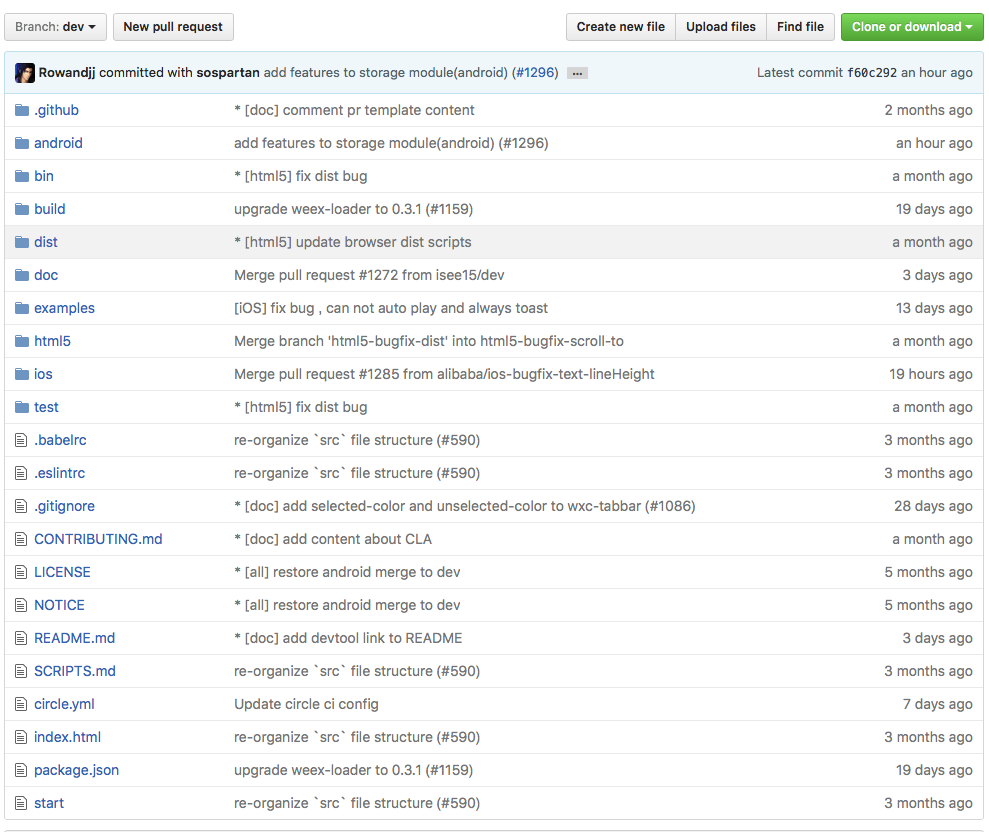

title: 初识Weexdemo-Example
categories:
- WEEX
date: 2016/9/13 20:46:25
---

##  了解Weex源码结构，修改example         
其实，写一个简单的带有样式的界面还是挺简单的。接下来就是要学习官方给的example示例，看一下官方的目录结构以及示例代码，开发过程中遇到的不明白的问题其实很多都能在官方demo里找到答案。         

## 1. 下载Weex源码     

[weexGithub](https://github.com/alibaba/weex)          
这里可以用 **git clone** 或者直接download

	$ git clone https://github.com/alibaba/weex.git    
	
## 2.了解源码结构        
代码下载完成了，先看一下源码的目录结构。  
     

有几个比较重要的目录和文件：  
     
+ package.json :	node_modules依赖，更重要的是里面包含了npm run xxx 等快捷命令。这里我们可以把它配置化，例如package.json文件中的：        

+ start文件: 启动程序文件，**相当于Windows下面的*.bat脚本文件**：      

		#called by native   
		THIS_DIR=$(dirname "$0")
		pushd "$THIS_DIR"

		npm run build:native
		npm run build:browser
		npm run serve &
		npm run dev:examples

		popd

其中npm run就是执行package.json中的定义好的脚本别名。          

+ examples: 示例Demo      
+ android/ios/html： 各平台代码   
+ build：打包各平台的脚本，配置在package.json中。         
<!--more-->
## 3.运行Weex          

下面是weex github仓库README.md，按照下面步骤即可跑起来。     

### Android 

0. Prerequisites
    0. Install [Node.js](http://nodejs.org/) 4.0+
    0. Under project root 
        0. `npm install`, install project 
        0. `./start`
    0. Install [Android Environment](http://developer.android.com/training/basics/firstapp/index.html)
0. Run playground, In Android Studio
    0. Open `android/playground`
    0. In `app/java/com.alibaba.weex/IndexActivity`, modify `CURRENT_IP` to your local IP
    0. Click  (`Run` button)
0. [Add an example](./examples/README.md#add-an-example)

#### Runtime

On Android Platform , Weex code is executed in [weex_v8core](https://github.com/alibaba/weex_v8core) which is based on Google V8 JavaScript engine.

### iOS

0. Prerequisites
	0. Install [Node.js](http://nodejs.org/) 4.0+
    0. Under project root 
        0. `npm install`, install project 
        0. `./start`
    0. Install [iOS Environment](https://developer.apple.com/library/ios/documentation/IDEs/Conceptual/AppStoreDistributionTutorial/Setup/Setup.html)
    0. Install [CocoaPods](https://guides.cocoapods.org/using/getting-started.html)
0. Run playground
    0. `cd ios/playground`
    0. `pod install`
    0. Open `WeexDemo.xcworkspace` in Xcode
    0. Click  (`Run` button) or use default shortcut `cmd + r` in Xcode
    0. If you want to run the demo on your device. In `DemoDefine.h`(you can search this file by Xcode default shortcut `cmd + shift + o`), modify `CURRENT_IP` to your local IP
 
运行的结果，如下图：             

      
但是，我们也希望在浏览器中看到效果，那么输入如下网站也可：     

	http://127.0.0.1:12580        
    
## 4.修改example            

          
其中index.we是入口文件。因此可以在example中增加一个文件。然后在index.we中增加一个name和title。          

刷新即可查看效果。      
 

## 5.如何学习       
到这里就可以调试单独的文件了，查看各种效果以及测试语法，开发过程中的问题还是建议阅读源码

